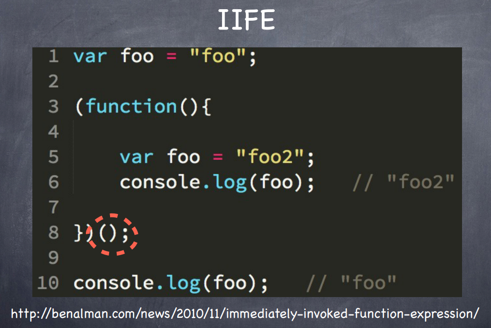

# IIFE Pattern

- Immediately Invoked Function Expression

- Putting a Function value into an expression stack and wrapping it in parenthesis, and then immediately executing the value of the the expressions stack.

- http://benalman.com/news/2010/11/immediately-invoked-function-expression/