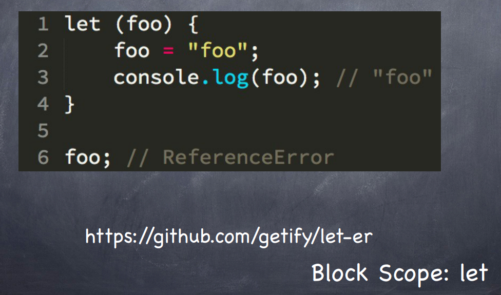
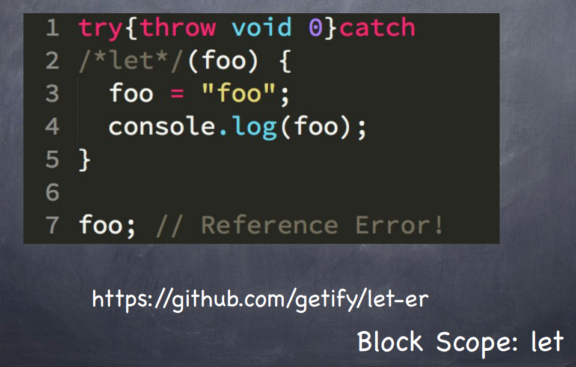

# Problems with the 'let' Keyword

- https://gist.github.com/getify/5285514

- https://github.com/getify/let-er

- The Transpiler will look through your entire code base, and only transpile your let blocks.

