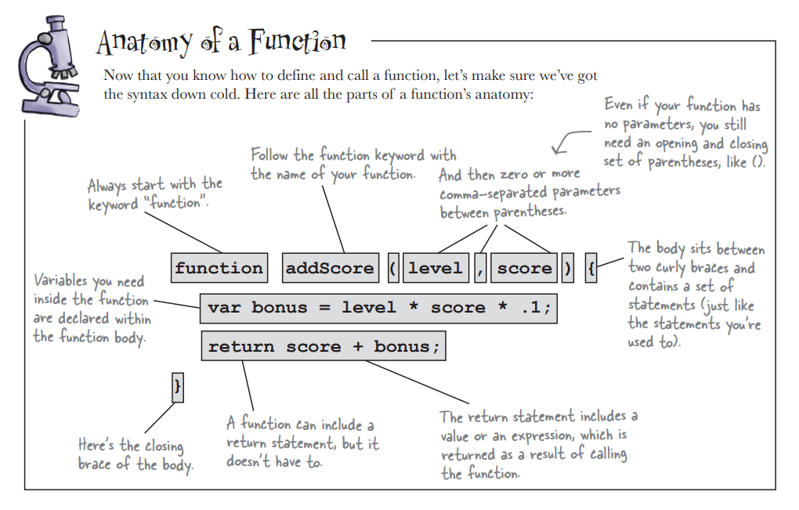

# Head First JavaScript Programming: A Brain-Friendly Guide

- Paperback - 10 April 2014
- Recommended by AndySterkowitz - https://www.youtube.com/channel/UCZ9qFEC82qM6Pk-54Q4TVWA
- Started reading on Saturday 18th Dec 2021

## Notes throughout the Book / Course

- functions / parameters & arguments from pages 89/90
- When you call a function you pass it arguments and those arguments then get matched up with the parameters in the function definition.
- You can also pass variables as arguments, and that's often the more common case.  See my_files/archive/index_copy6.js for examples.  

https://www.freecodecamp.org/news/three-ways-to-return-largest-numbers-in-arrays-in-javascript-5d977baa80a1/

https://www.codegrepper.com/search.php?answer_removed=1&q=-=%20javascript

- use cases (in this case they do the same thing)
  - while (answer != "forty-two");
  - for (;answer != "forty-two");
