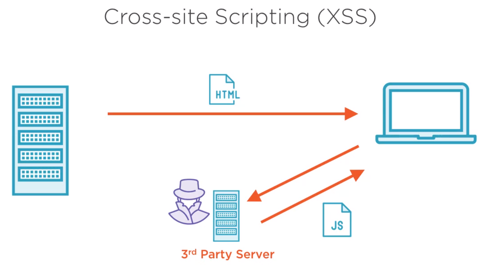

## Cross-site Scripting (XSS)

### Addressing Cross-site Scripting Attacks

- SCP: Content Security Policy
  - Use HTTP Header: Content-Security-Policy

- CORS: Cross Origin Resource Sharing
  - Use HTTP Header: Access-Control-Allow-Origin

